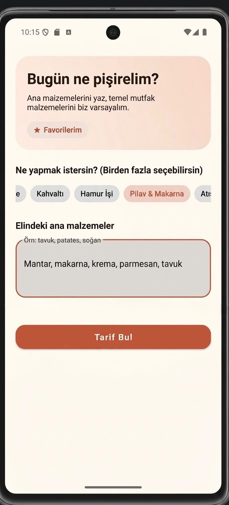
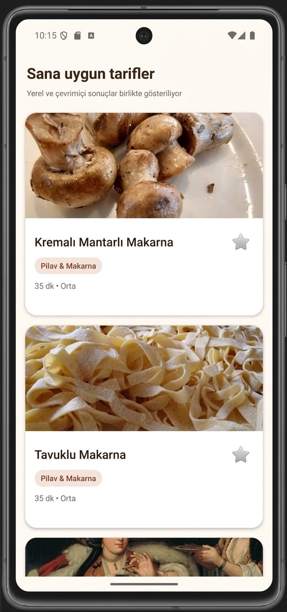
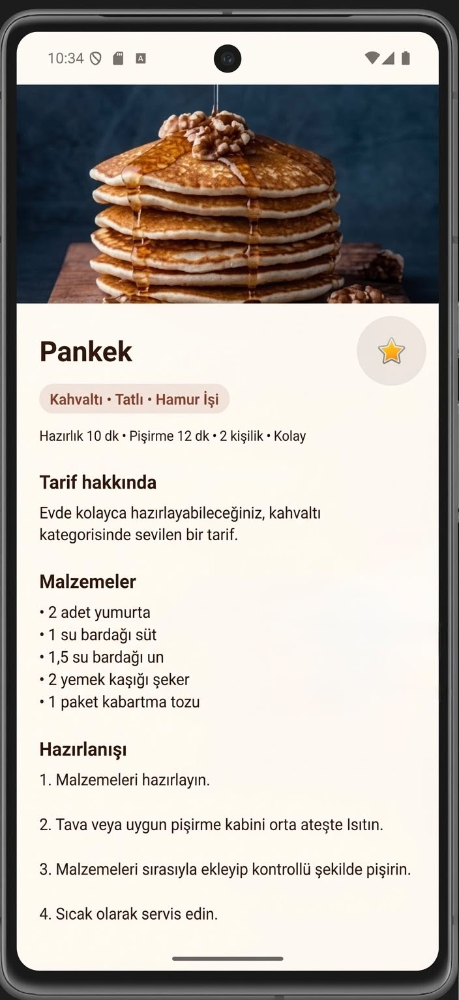
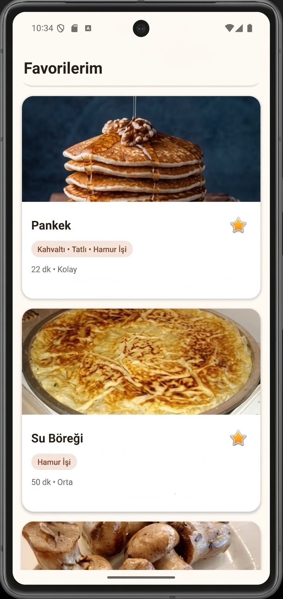

  

<h1 align="center">TarifCep 🍽️</h1>

  <strong>Elindekileri yaz, ne pişireceğine TarifCep karar versin.</strong>

TarifCep; kullanıcıların evlerinde bulunan ana malzemeleri değerlendirerek uygun yemek, tatlı, hamur işi, kahvaltılık ve içecek tariflerini keşfetmelerine yardımcı olan Java ve XML tabanlı bir Android uygulamasıdır.

Bu proje, farklı yemekler denemeyi ve evde bulunan malzemeleri değerlendirmeyi seven biri olarak geliştirdiğim ilk Android uygulama çalışmamdır.

## 📱 Ekran Görüntüleri

  
  
  
  

## ✨ Özellikler

- Evde bulunan malzemelere göre tarif önerme
- Ana malzemeleri ve temel mutfak malzemelerini ayırt etme
- Eksiksiz hazırlanabilen tarifleri sonuçların üst sırasında gösterme
- Birden fazla kategori seçebilme
- Bir tarifin birden fazla kategoride bulunabilmesi
- İnternet bağlantısı olmadan yerel tarifleri görüntüleme
- TheMealDB API aracılığıyla çevrimiçi tarif arama
- Tarifleri favorilere ekleme
- Tarif malzemelerini, hazırlanışını ve süre bilgilerini görüntüleme
- Çevrimiçi tarif fotoğraflarını gösterme
- Fotoğraf bulunmadığında yerel varsayılan görsel kullanma

## 🍴 Tarif Kategorileri

- Ana Yemek
- Çorba
- Salata
- Meze
- Kahvaltı
- Hamur İşi
- Pilav ve Makarna
- Atıştırmalık
- Tatlı
- İçecek

Tarifler birden fazla kategori etiketi taşıyabilir. Örneğin bir kek tarifi hem **Tatlı** hem de **Hamur İşi** kategorisinde görüntülenebilir.

## 🛠️ Kullanılan Teknolojiler

- Java
- XML
- Android Studio
- Material Design
- RecyclerView
- Retrofit
- OkHttp
- Gson
- Glide
- TheMealDB API
- JSON

## ⚙️ Uygulamanın Çalışma Mantığı

1. Kullanıcı elindeki ana malzemeleri yazar.
2. İsterse bir veya birden fazla tarif kategorisi seçer.
3. Uygulama su, tuz, yağ ve temel baharatlar gibi yaygın mutfak malzemelerini varsayar.
4. Yerel ve çevrimiçi tarifler kullanıcının malzemeleriyle karşılaştırılır.
5. Eksiksiz hazırlanabilen tarifler ilk sırada gösterilir.
6. Diğer tarifler eşleşen ve eksik ana malzeme sayılarına göre sıralanır.

## 🚧 Proje Durumu

TarifCep aktif olarak geliştirilmektedir. Bu sürüm, uygulamanın ilk çalışan demo sürümüdür. Kullanıcı deneyimi, tarif çeşitliliği, görseller ve çevrimiçi servisler üzerinde geliştirmeler devam etmektedir.

## 🔒 Kaynak Kod Hakkında

Bu repository yalnızca **TarifCep uygulamasının tanıtılması ve geliştirme sürecinin paylaşılması amacıyla** hazırlanmıştır.

Uygulamanın kaynak kodları açık kaynak değildir ve bu repository içerisinde yayımlanmamaktadır. Tüm hakları saklıdır.

## 👩‍💻 Geliştirici

**Buse Ulukaya**  
Bilgisayar Mühendisliği öğrencisi

---

⭐ TarifCep’in geliştirme sürecini takip etmek için repository’yi yıldızlayabilirsiniz.
